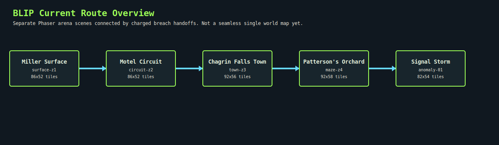
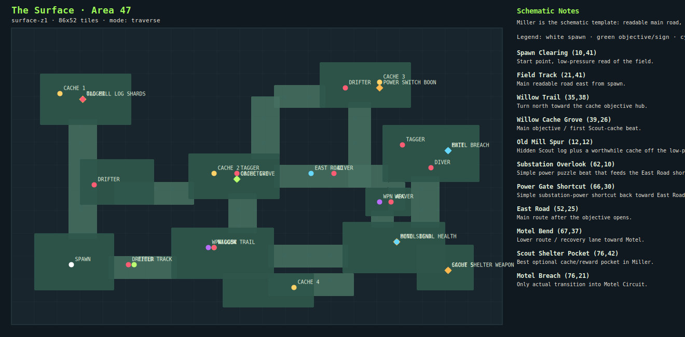
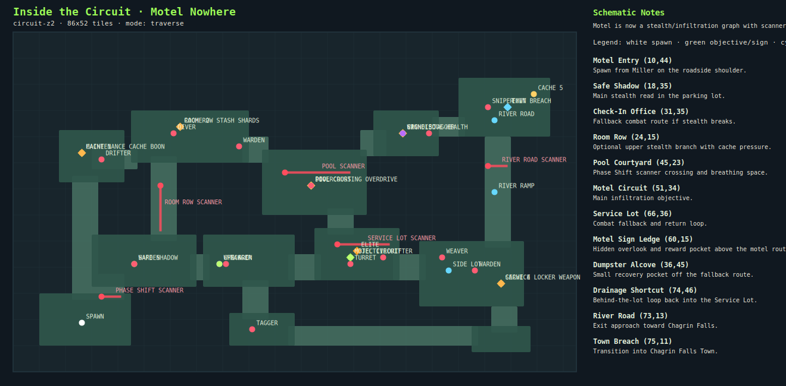
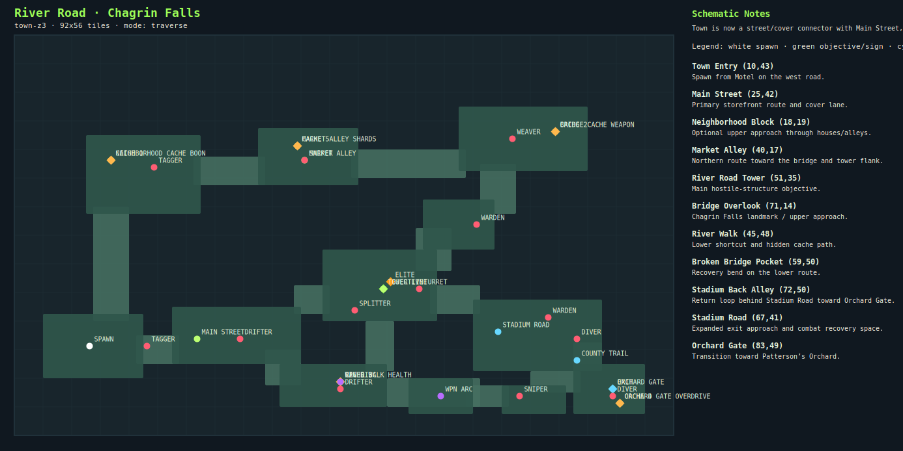
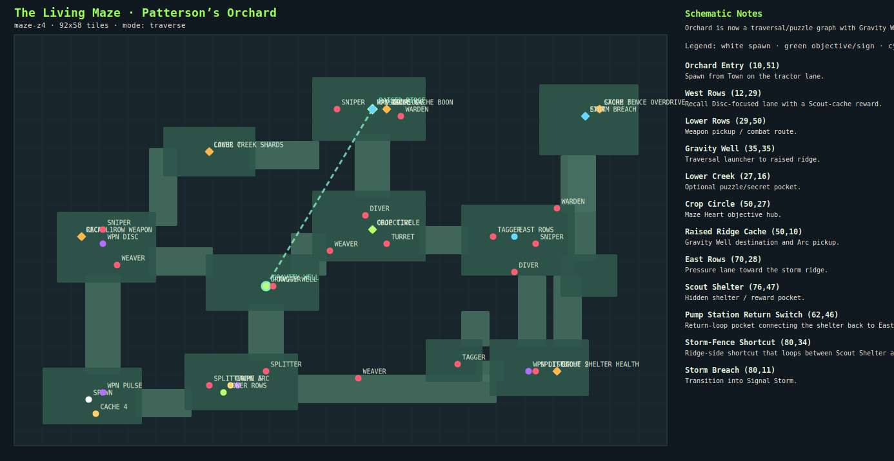
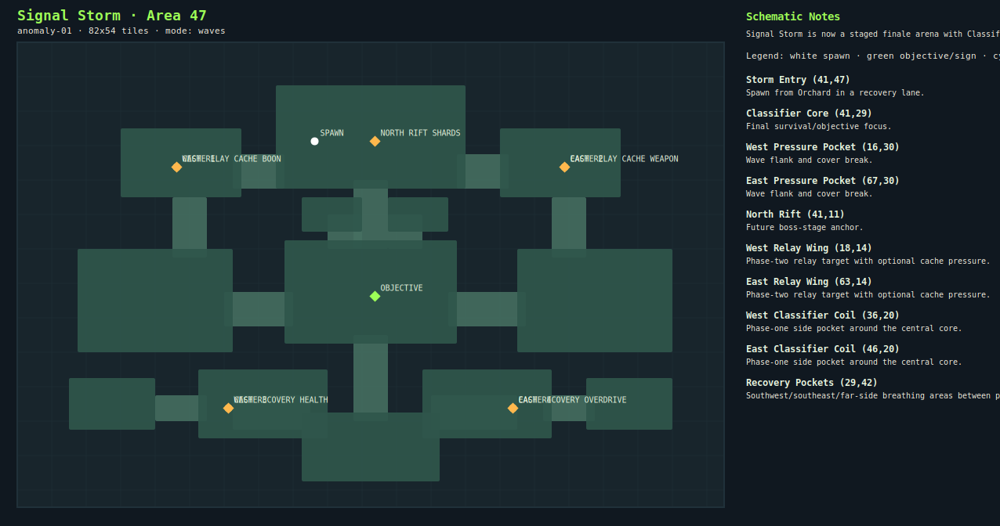

# BLIP Map Schematics

Generated from the current arena data in `src/game/data/sweepArenas.ts`.

These schematics are planning artifacts for map redesign prompts. They show the authored tile graph from a true top-down view: rooms, halls, spawn points, objectives, exits, caches, weapon pickups, route signs and enemy placements. They do not show every decorative rock/tree generated by the HD terrain renderer.

## Current Map Direction

- Keep the five-region route architecture: Miller Surface -> Motel Circuit -> Chagrin Falls Town -> Patterson's Orchard -> Signal Storm.
- Do not blindly scale rectangles. Use schematic-first authoring: main route, optional branch, secret pocket, return/shortcut logic, then enemies and rewards.
- Miller is the template: bigger physical space with named branches and one real far-east Motel transition.
- Motel, Town, Orchard and Signal Storm now have schematic-first expanded layouts too. They still need live feel review and gameplay/puzzle polish.
- Current design pass: every region now tracks a clear main route, optional branch, secret pocket, shortcut/return loop, purposeful enemy spaces, reward pocket and explicit exit approach.
- AI route-guidance tuning should wait until the map schematics are stable enough that bots are not trained around temporary coordinates.

## 1. The Surface · Area 47

- Arena id: `surface-z1`
- Grid: `86x52` tiles
- Spawn: `10,41`
- Objective: `39,26`
- Exit: `76,21`
- Enemies: 3 drifter, 4 tagger, 2 diver, 1 weaver
- Caches: `8,11`, `35,25`, `64,9`, `49,45`, `76,42`
- Field events: `OLD MILL LOG@12,12:scan:shards`, `POWER SWITCH@64,10:enter:boon`, `SCOUT SHELTER@76,42:scan:weapon`, `BEND SIGNAL@67,37:enter:health`
- Weapon pickups: `disc@34,38`, `arc@64,30`
- Current intent: Miller is the schematic template: readable main road, objective grove, optional old-mill/substation/shelter branches, power-gate shortcut, and one far-east Motel breach.

Key locations:

- `10,41` Spawn Clearing: Start point, low-pressure read of the field.
- `21,41` Field Track: Main readable road east from spawn.
- `35,38` Willow Trail: Turn north toward the cache objective hub.
- `39,26` Willow Cache Grove: Main objective / first Scout-cache beat.
- `12,12` Old Mill Spur: Hidden Scout log plus a worthwhile cache off the low-pressure main route.
- `62,10` Substation Overlook: Simple power puzzle beat that feeds the East Road shortcut.
- `66,30` Power Gate Shortcut: Simple substation-power shortcut back toward East Road.
- `52,25` East Road: Main route after the objective opens.
- `67,37` Motel Bend: Lower route / recovery lane toward Motel.
- `76,42` Scout Shelter Pocket: Best optional cache/reward pocket in Miller.
- `76,21` Motel Breach: Only actual transition into Motel Circuit.

## 2. Inside the Circuit · Motel Nowhere

- Arena id: `circuit-z2`
- Grid: `86x52` tiles
- Spawn: `10,44`
- Objective: `51,34`
- Exit: `75,11`
- Enemies: 3 warden, 3 tagger, 2 diver, 1 turret, 2 drifter, 1 sniper, 1 weaver
- Caches: `10,18`, `25,14`, `59,15`, `74,38`, `79,9`
- Field events: `MAINTENANCE CACHE@10,18:scan:boon`, `ROOM ROW STASH@25,14:scan:shards`, `POOL CROSSING@45,23:enter:overdrive`, `SERVICE LOCKER@74,38:scan:weapon`, `SIGN LEDGE@59,15:scan:health`
- Weapon pickups: `arc@31,35`, `disc@59,15`
- Current intent: Motel is now a stealth/infiltration graph with scanner route, upper room-row branch, hidden maintenance path, service-lot fallback, drainage loop and River Road exit.

Key locations:

- `10,44` Motel Entry: Spawn from Miller on the roadside shoulder.
- `18,35` Safe Shadow: Main stealth read in the parking lot.
- `31,35` Check-In Office: Fallback combat route if stealth breaks.
- `24,15` Room Row: Optional upper stealth branch with cache pressure.
- `45,23` Pool Courtyard: Phase Shift scanner crossing and breathing space.
- `51,34` Motel Circuit: Main infiltration objective.
- `66,36` Service Lot: Combat fallback and return loop.
- `60,15` Motel Sign Ledge: Hidden overlook and reward pocket above the motel route.
- `36,45` Dumpster Alcove: Small recovery pocket off the fallback route.
- `74,46` Drainage Shortcut: Behind-the-lot loop back into the Service Lot.
- `73,13` River Road: Exit approach toward Chagrin Falls.
- `75,11` Town Breach: Transition into Chagrin Falls Town.

## 3. River Road · Chagrin Falls

- Arena id: `town-z3`
- Grid: `92x56` tiles
- Spawn: `10,43`
- Objective: `51,35`
- Exit: `83,49`
- Enemies: 2 tagger, 2 drifter, 2 sniper, 1 turret, 1 weaver, 2 warden, 2 diver, 1 splitter
- Caches: `13,17`, `75,13`, `45,48`, `84,51`, `39,15`
- Field events: `NEIGHBORHOOD CACHE@13,17:scan:boon`, `MARKET ALLEY@39,15:enter:shards`, `BRIDGE CACHE@75,13:scan:weapon`, `RIVER WALK@45,48:scan:health`, `ORCHARD GATE@84,51:enter:overdrive`
- Weapon pickups: `disc@45,48`, `arc@59,50`
- Current intent: Town is now a street/cover connector with Main Street, neighborhood/market upper approach, bridge overlook, river-walk shortcut, stadium back alley and Orchard Gate.

Key locations:

- `10,43` Town Entry: Spawn from Motel on the west road.
- `25,42` Main Street: Primary storefront route and cover lane.
- `18,19` Neighborhood Block: Optional upper approach through houses/alleys.
- `40,17` Market Alley: Northern route toward the bridge and tower flank.
- `51,35` River Road Tower: Main hostile-structure objective.
- `71,14` Bridge Overlook: Chagrin Falls landmark / upper approach.
- `45,48` River Walk: Lower shortcut and hidden cache path.
- `59,50` Broken Bridge Pocket: Recovery bend on the lower route.
- `72,50` Stadium Back Alley: Return loop behind Stadium Road toward Orchard Gate.
- `67,41` Stadium Road: Expanded exit approach and combat recovery space.
- `83,49` Orchard Gate: Transition toward Patterson’s Orchard.

## 4. The Living Maze · Patterson’s Orchard

- Arena id: `maze-z4`
- Grid: `92x58` tiles
- Spawn: `10,51`
- Objective: `50,27`
- Exit: `80,11`
- Enemies: 3 sniper, 3 weaver, 3 splitter, 3 tagger, 1 turret, 2 warden, 2 diver
- Caches: `9,28`, `76,47`, `82,10`, `11,53`, `30,49`, `52,10`, `27,16`
- Field events: `LOWER CREEK@27,16:scan:shards`, `RECALL ROW@9,28:scan:weapon`, `RIDGE CACHE@52,10:enter:boon`, `SCOUT SHELTER@76,47:scan:health`, `STORM FENCE@82,10:scan:overdrive`
- Weapon pickups: `pulse@12,50`, `disc@12,29`, `arc@50,10`, `disc@72,47`, `arc@31,49`
- Current intent: Orchard is now a traversal/puzzle graph with Gravity Well gate, raised ridge, lower creek secret, Scout shelter loop, pump-station return and storm-ridge exit.

Key locations:

- `10,51` Orchard Entry: Spawn from Town on the tractor lane.
- `12,29` West Rows: Recall Disc-focused lane with a Scout-cache reward.
- `29,50` Lower Rows: Weapon pickup / combat route.
- `35,35` Gravity Well: Traversal launcher to raised ridge.
- `27,16` Lower Creek: Optional puzzle/secret pocket.
- `50,27` Crop Circle: Maze Heart objective hub.
- `50,10` Raised Ridge Cache: Gravity Well destination and Arc pickup.
- `70,28` East Rows: Pressure lane toward the storm ridge.
- `76,47` Scout Shelter: Hidden shelter / reward pocket.
- `62,46` Pump Station Return Switch: Return-loop pocket connecting the shelter back to East Rows.
- `80,34` Storm-Fence Shortcut: Ridge-side shortcut that loops between Scout Shelter and Storm Breach.
- `80,11` Storm Breach: Transition into Signal Storm.

## 5. Signal Storm · Area 47

- Arena id: `anomaly-01`
- Grid: `82x54` tiles
- Spawn: `41,47`
- Objective: `41,29`
- Exit: `none / waves finale`
- Enemies: none
- Caches: `18,14`, `63,14`, `24,42`, `57,42`
- Field events: `WEST RELAY CACHE@18,14:scan:boon`, `EAST RELAY CACHE@63,14:scan:weapon`, `WEST RECOVERY@24,42:enter:health`, `EAST RECOVERY@57,42:enter:overdrive`, `NORTH RIFT@41,11:scan:shards`
- Weapon pickups: none
- Current intent: Signal Storm is now a staged finale arena with Classifier Core, relay wings, coil pockets, north rift, pressure pockets and real recovery pockets instead of anonymous waves.

Key locations:

- `41,47` Storm Entry: Spawn from Orchard in a recovery lane.
- `41,29` Classifier Core: Final survival/objective focus.
- `16,30` West Pressure Pocket: Wave flank and cover break.
- `67,30` East Pressure Pocket: Wave flank and cover break.
- `41,11` North Rift: Future boss-stage anchor.
- `18,14` West Relay Wing: Phase-two relay target with optional cache pressure.
- `63,14` East Relay Wing: Phase-two relay target with optional cache pressure.
- `36,20` West Classifier Coil: Phase-one side pocket around the central core.
- `46,20` East Classifier Coil: Phase-one side pocket around the central core.
- `29,42` Recovery Pockets: Southwest/southeast/far-side breathing areas between phases.

